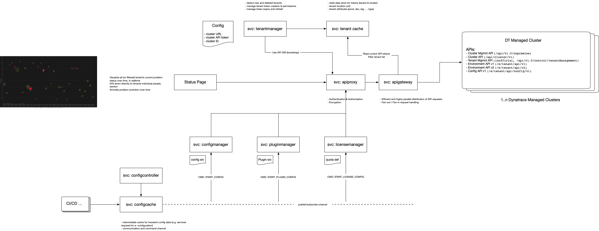

## Dynatrace Configuration Management Service

This project and toolset is aimed to help the complete automation of configuration management of one or many (!) Dynatrace tenants or environments. The idea is to manage every configuration aspect of an environment as code and never touch the Dynatrace UI for making any configuration changes.

This fulfills the requirements that are imposed by managing large Dynatrace setups with multiple thousand tenants but is also applicable for smaller environments where you need a clean configuration management or a strict pipeline where you not only handle your applications but also the Dynatrace configuration that goes along with it.

The goal is to provide:
- complete configuration as code for any settings or configuration items of Dynatrace tenants
- auditing and verifying of configuration settings changes
- transport of configuration between Dynatrace tenants (e.g. from development to staging to production)
- synchronization of configuration settings between tenants
- backup and export of configuration settings

## Prerequisites

The current version has been built with dependency to my Dynatrace consolidation API project, which allows the efficient access of thousands of Dynatrace environments via a single entry point. This was the original scale requirement. While when working only with a small number of Dynatrace tenants this might not be required, but it also simplifies things a bit.
In the future this dependency might be removed. For now you will need the consolidation API service as well to use this configuration management toolset.

For more info please see: https://bit.ly/dtapi-ii

## Setup

Create a .env file in the docker directory to store your credentials for the Dynatrace Consolidated API:

e.g.:
```
# the host of the consolidate dynatrace API
API_HOST=https://consolidated.dynatrace.api
# User credentials for the consolidated API
API_USER=apiuser
API_PWD=<password>
```

## Services

The configuration service consists of multiple service components and uses a separate project (Dynatrace Consolidation API) for the actual access of the multiple Dynatrace APIs.



### Config Manager

This service is responsible to pushing the standard configs to all tenants. The standard configs are defined in entites which are defined on the standard Dynatrace JSON configuration files (DTOs). The configuration files are located in the ```config``` subdirectory. This is the source of your standard configuration set that will be maintained as code.
The configuration set itself is defined in a yaml file ```entities.yml``` located in this directory. This file defines which configuration entities from the source ```config``` directory the config manager will consider when maintaining the configuration of tenants. The ```entities.yml``` file alse defines metadata of config entities (e.g. their custom predefined ID or names)  

The ```entities.yml``` file has the following structure (see details in the [schema definition](docker/configmanager/configset/ConfigSchema.py)), which follows the API path of the respective configuration entity:

entities.yml:
```
config:
  v1:
    applications:
      web:
      mobile:
    service:
      customServices:
        java: 
          - file: mycustomservice.json
            name: "My Custom Service"       (optional: can be defined in the json file)
            id: "0000-uuid-..."             (optional: will be generated automatically to be consistent)
    autoTags:
      - file: myautotag.json
      - file: myotherautotag.json
```

[Example entities.yml (created from config dump)](docker/config_dump/entities.yml)

The  structure of the ```config``` directory follows the the structure of the ```entities.yml``` file. E.g. for the above definition the config directory structure will look like this:
```
config/v1/service/customServices/java/mycustomservice.json
config/v1/autoTags/myautotag.json
config/v1/autoTags/myotherautotag.json

[Example config directory](docker/config_dump/)
```
Every configurable (available via the Dynatrace API) enity is supported. The config directory structure also follows the respective API URI of the Dynatrace API. For example JSON files for service metrics (API URI = ../calculatedMetrics/service) will reside in a subdirectory ./calculatedMetrics/service.
When exporting configuration from a tenant also this directory structure is generated and also a respective ```entities.yml``` file is created.

So get an example just run this service with the ```PULL_CONFIG``` command as described below.

### Plugin Manager

The pluginmanager service is responsible to deploy standard (JMX) Plugins to tenants. Plugins are maintained in the subdirectory ```plugins```. Every plugin is located in a directory which is named like the plugin's id. Within that directory a plugin.json file must be located which defines the plugin and also must have the same name attribute as the plugin id.

The ```pluginconfig.yml``` defines which plugins should be deployed by the pluginmanager.

### License Manager

The licensemanager service is used to push license quotas - mainly DEM units and storage quotas to tenants. Currently the license entitlements are configured in a file ```licensquotal.yml```
This file holds the default values which are aplied if not overridden by a tenant-specific configuration. To manage license quotas the Dynatrace Managed cluster API is currently used. This feature cannot be used on the Dynatrace SaaS version

licensequota.yml:
```
default:
  demUnitsAnnualQuota: 0
  demUnitsQuota: 0
  sessionStorageQuota: 2147483647
    
tenants:
  clusterid:
    tenant-id1:
      demUnitsAnnualQuota: 6900000
      demUnitsQuota: 690000
    tenant-id2:
      demUnitsAnnualQuota: 75000
      demUnitsQuota: 75000
```

The licensemanager always applies these values regardless of what values already exist on the respective tenant. If additional quotas should be added to Dynatrace you must add that in the config file.

### Config Cache

The configcache service is a redis cache that is used for intermediate storage while configuring tenants. It is also used as a controller mechanism to steer the execution of pluginmanger and configmanager by using a publish/subscriber pattern. Configmanager and Pluginmanger are subscribed to a "configcontrol" channel to listen for command messages.

## Controlling & Pushing Configs

### General Procedure
The configmanager is the core component to control configuration operations. The general mode of operation is as follows:
1. when the configmanager service starts it loads the standard config set that is defined via the ```entities.yml``` in the ```config``` directory (mounted as volume to the docker container)
1. it will join the ```configcontrol``` pub/sub channel on the redis instance (configcache) - so the configcache service has to be started before
1. it will wait for commands on the ```configcontrol``` channel and execute the according functions when received


### Execution of Configuration Actions
To execute specific actions in ```configmanager``` one must publish a command with parameters to the ```configcontrol``` redis channel.
These commands are basically a set op options structured in a json format sent to the channel. They contain all settings needed for the configmanager to perform it's work.
This includes:
1. which command to execute (PUSH, PULL, RESET, ...)

| Command       | Parameters     | Function  |
| ------------- |:----------------------- | :-----|
| PUSH_CONFIG   | source, config      | pushes the config entities that have been enabled in ```config``` of the standard configuration set to the tenants defined in ```paremeters``` |
| PULL_CONFIG   | target, config                  | fetches all supported configuration settings of the tenant(s) defined in ```source``` and dumps them to a temporary directory ```config_dump``` |
| RESET         |                         | resets the standard configuration to the initial config set, loading from the config directory (e.g. after a PULL_CONFIG) |

Furthermore the configmanager confirms the processing of a command by also publishing a ```FINISHED_CONFIG``` message to the ```configcontrol``` communication channel. 

#### Parameters
The following parameters control which configuration entities are pusehd or to/from which tenants a config is pusehd or pulled. Parameters are stored in the configcache redis instance and are generally stored as JSON format.

| Parameter | Description | Example |
| --------- |:----------- |:------- |
| config    | a list of flags which configtypes should be considered when pushing configuration settings | please see [push_command.json](docker/test/push_command.json) |
| source, target | parameters used for the consolidateion API to select the right tenant(s)/dynatrace setups when executing commands | please see [push_command.json](docker/test/push_command.json) |


### Examples

To trigger a configuration push to one or multiple/all tenants (connected via the consolidateion API) we need to let the configmanager know to which tenants the configurations should be pushed. This can be done by publishing a message to the configcache "configcontrol" channel. This can be done directly via the configcache redis client or with any automation integration tool that publishes the control messages to redis.

Launch the configcache and the configmanager services:
```
CONTAINER ID   IMAGE                              COMMAND                  CREATED             STATUS             PORTS      NAMES
e157b20ec920   360performance/configmanager:dev   "python configmanage…"   About an hour ago   Up About an hour              configmanager
76d8c845fcab   360performance/configcache:dev     "docker-entrypoint.s…"   2 weeks ago         Up 24 hours        6379/tcp   configcache
```

Read a command from a file and push it to the configcontrol channel (examples located in ```docker/test```)
```
docker exec -i configcache redis-cli -x publish configcontrol < test/pull_command.json
```

This will then trigger a config pull and dump from the tenenat specified in the command file:
```
docker logs -f configmanager
```

```
2023-01-10 15:28:59,635:ALWAYS: Received Command: PULL_CONFIG
2023-01-10 15:28:59,635:ALWAYS: ========== STARTING CONFIG PULL ==========
2023-01-10 15:28:59,635:INFO: Source: 
{
  "mode": "saas",
  "clusterid": "360perf",
  "dryrun": true
}
2023-01-10 15:28:59,640:INFO: Config: 
{
  "configtypes.config_v1.alertingProfiles.alertingProfiles": true,
  "configtypes.config_v1.allowedBeaconOriginsForCors.allowedBeaconOriginsForCors": true,
  "configtypes.config_v1.applicationDetectionRules.applicationDetectionRules": true,
  "configtypes.config_v1.applicationDetectionRuleshostDetection.applicationDetectionRuleshostDetection": true,
  "configtypes.config_v1.applicationsmobile.applicationsmobile": true,
  "configtypes.config_v1.applicationsmobileAppIduserActionAndSessionProperties.applicationsmobileAppIduserActionAndSessionProperties": true,
  "configtypes.config_v1.applicationsmobilekeyUserActions.applicationsmobilekeyUserActions": true,
  "configtypes.config_v1.applicationsweb.applicationsweb": true,
  "configtypes.config_v1.applicationswebdataPrivacy.applicationswebdataPrivacy": true,
  "configtypes.config_v1.applicationsweberrorRules.applicationsweberrorRules": true,
  "configtypes.config_v1.applicationswebkeyUserActions.applicationswebkeyUserActions": true,
  "configtypes.config_v1.autoTags.autoTags": true,
  ...
}

... lots of dump actions here ...

2023-01-10 15:29:10,550:ALWAYS: ========== FINISHED CONFIG PULL ==========
2023-01-10 15:29:10,551:ALWAYS: Processed Command: PULL_CONFIG
```

After the command has finished you will find your configuration set in the ```config_dump``` directory and the duped configuration will be loaded as standard set for further commands.

#### Example: clone a configuration set from one Dynatrace tenant to another

You can transfer/clone all configurations of one Dynatrace tenant to another by performing a dump on one tenant and then push the config to another one. To achieve this you first need to "connect" both tenants to the dynatrace consolidation API, so that the configmanager can easily access both tenants.
Then all you need to do is first execute a PULL command and then a PUSH command with different source/target parameters:

First pull the config (only autotags in this case) with a command file (pull_command.json) like this:

```
{
    "command": "PULL_CONFIG",
    "source": {
        "mode": "saas",
        "clusterid": "360perf-dev"
    },
    "config": {
        "config_v1.alertingProfiles": true,
        "config_v1.autoTags": true
    }
}
```

```
docker exec -i configcache redis-cli -x publish configcontrol < pull_command.json
```

Now the configmanager has dumped all autoTag and alertingProfile configurations to the dump directory and has loaded this config set into it's cache.
To push this configuration (or parts of it) you can now issue another command (push_command.json):

```
{
    "command": "PUSH_CONFIG",
    "target": {
        "mode": "saas",
        "clusterid": "360perf-prod"
    },
    "config": {
        "config_v1.alertingProfiles": false,
        "config_v1.autoTags": true
    }
}
```

```
docker exec -i configcache redis-cli -x publish configcontrol < push_command.json
```

And voila you will have replicated all your autoTags from one tenant to another (note the 'false' setting for alertingProfiles, hence they are skipped)